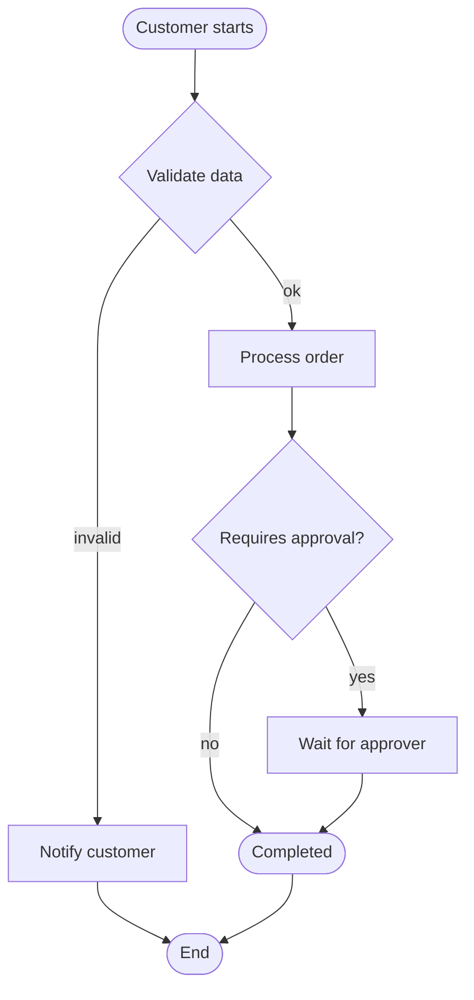
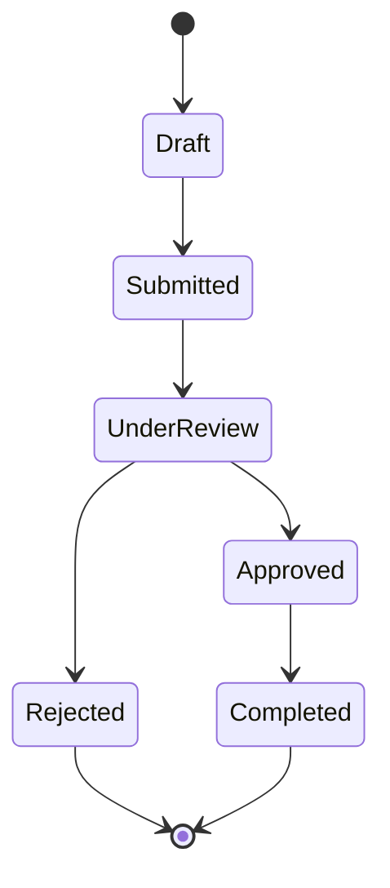
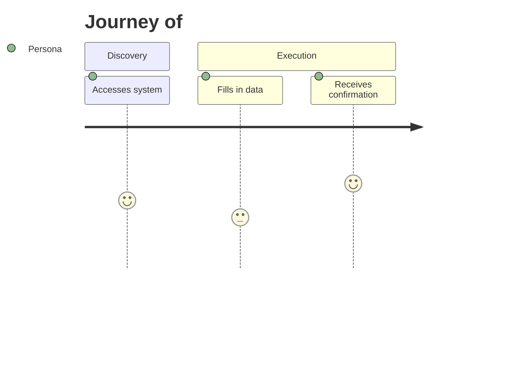
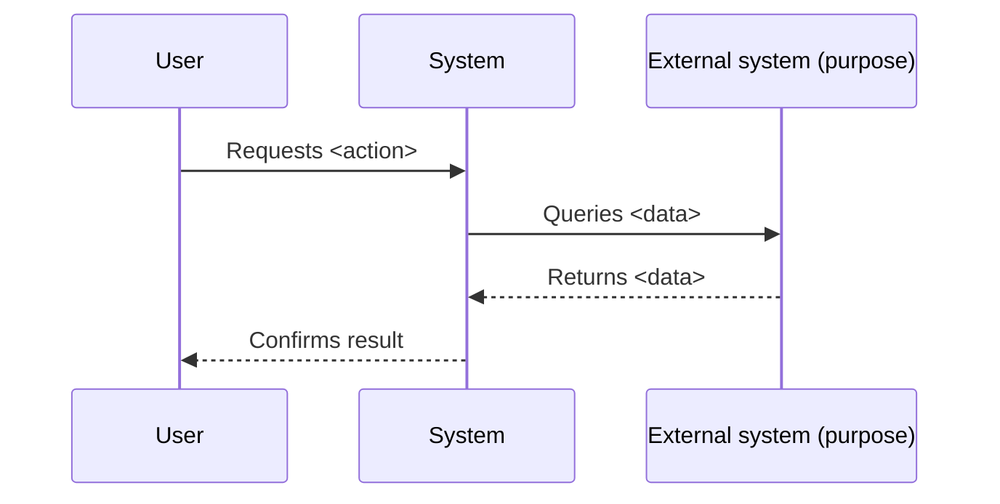

<!-- _header.md at the top -->

# Flows — <feature>

> All diagrams use **business language**. No technical names in default mode.

## Main flow — <process name>

## Lifecycle — <entity>

## User journey

## Interaction with external systems

## Decisions and exceptions
- Decision 1: ...
- Exception 1: ...
