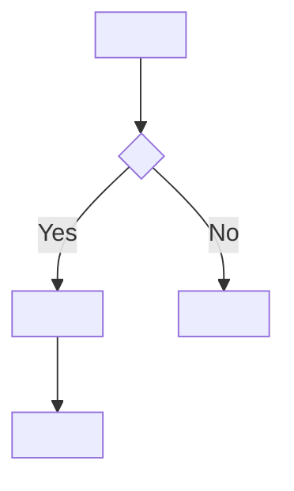

**Confidence:** High | Medium | Low

# Feature: <Feature Name>

## 1. Identification
- **Feature ID:** FUNC-<NNN>
- **Version:** 0.1.0
- **Date:** <YYYY-MM-DD>
- **Owner:** TBD
- **Status:** draft | under review | approved | implemented
- **Source:** <stakeholder / requesting area>

## 2. Overview
<Objective description of the feature and its business purpose. Max. 6 lines. No technical jargon in default mode.>

**Business problem it solves:** <short text>
**Expected outcome:** <short text>

## 3. Local glossary
Terms specific to this feature. Global terms live in `01-glossario.md`.

| Term | Definition |
|---|---|
| <Term> | <Short definition> |

## 4. Actors and profiles
| Actor | Description | Access type |
|---|---|---|
| <Persona / role> | <What they do in the context of this feature> | Read / Write / Full / Approval |

## 5. Preconditions
- <Condition 1 that must be true before use>
- <Condition 2>

## 6. Postconditions
- <Resulting state 1 after successful execution>
- <Resulting state 2>

## 7. Functional requirements (RF)

> **Rule:** one RF = one atomic, testable capability with no ambiguity. Use imperative present tense ("The system shall..."). Never state **how** to implement.

### RF-<slug>-001: <Short title>
- **Description:** The system shall <action> when <condition>, resulting in <outcome>.
- **User story:** As <actor>, I want <action>, so that <benefit>.
- **Step-by-step (happy path):**
  1. <Actor does X>
  2. System validates <condition>
  3. System executes <process>
  4. System returns <outcome>
- **Acceptance criteria (Gherkin):**
  - Given <context>, when <action>, then <expected outcome>
  - Given <context>, when <action>, then <expected outcome>
- **Applicable business rules:** RN-<slug>-001, RN-<slug>-002
- **Specific preconditions:** <optional, if different from section 5>
- **Specific postconditions:** <optional, if different from section 6>
- **Priority (MoSCoW):** Must have | Should have | Could have | Won't have
- **Actors involved:** <role(s)>
- **Source:** <stakeholder>
- **Dependencies:** RF-<slug>-002, NRF-<NNN>
- **Traceability:** US-<slug>-NNN, UC-<slug>-NNN, TC-NNN
- **Status:** draft | approved | implemented
- **Confidence:** High | Medium | Low (tag: [Fact] | [Hypothesis] | [Question])

### RF-<slug>-002: <Short title>
<repeat>

## 8. Non-functional requirements (NRF) specific to the feature

> **Global** NRFs (general uptime, security standards, product privacy/compliance) live in `08-requisitos-nao-funcionais.md`. Only NRFs specific to this feature belong here.

### NRF-<slug>-001: <Category> — <Short title>
- **Description:** The system shall <property> under <condition> with <metric>.
- **Category:** Performance | Security | Availability | Scalability | Usability | Reliability | Compatibility | Maintainability | Legal/Compliance
- **Metric:**
  - Target value: <number + unit>
  - Minimum acceptable value: <number + unit>
  - Unit: <ms | req/s | % | users | ...>
- **Application conditions:** <scenario/environment>
- **Verification method:** Load test | Code inspection | Static analysis | Penetration test | Audit | Production observation
- **Priority:** Critical | High | Medium | Low
- **Dependencies:** NRF-NNN, RF-<slug>-NNN
- **Confidence:** High | Medium | Low (tag: [Fact] | [Hypothesis] | [Question])

### NRF-<slug>-002: ...

## 9. Main flow (happy path)
Step-by-step description of the error-free flow.

1. <Step>
2. <Step>
3. <Step>

### Diagram

## 10. Alternative flows and exceptions

### Exception E-001: <Name>
- **Trigger:** <What causes it>
- **System action:** <Response>
- **User message:** "<text>"
- **Affected RF:** RF-<slug>-NNN

### Exception E-002: ...

## 11. Screens / interfaces
- <Link to mockup / Figma / wireframe>
- <Description of main fields>

| Field | Type | Required | Rule |
|---|---|---|---|
| <Field> | <Type> | Yes/No | <Validation rule> |

## 12. Data involved (business view)

> Default mode: **do not** cite table/column. Describe business entities. With `--add-code`, mapping to technical entities is allowed in `## Technical evidence`.

| Business entity | Attribute | Type | Required | Rule |
|---|---|---|---|---|
| <Order> | <Amount> | Decimal | Yes | > 0 |

## 13. Integrations
| External system | Purpose | Data exchanged (high level) | Criticality |
|---|---|---|---|
| <System> | <What it is for> | <What goes in/out in business terms> | High/Medium/Low |

## 14. Traceability
| Artifact | IDs |
|---|---|
| User stories | US-<slug>-NNN |
| Use cases | UC-<slug>-NNN |
| Business rules | RN-<slug>-NNN |
| Test cases | TC-NNN |
| Open questions | Q-NNN |
| Source business documentation | <path/file> (when converted) |

## 15. Quality checklist
- [ ] All RFs and NRFs have a unique ID
- [ ] Descriptions are unambiguous ("shall", not "may")
- [ ] Each RF is atomic (a single capability)
- [ ] Each RF has Gherkin acceptance criteria
- [ ] Each NRF has a numeric metric and verification method
- [ ] Pre/postconditions defined
- [ ] Priority defined (MoSCoW for RF; Critical/High/Medium/Low for NRF)
- [ ] Dependencies mapped (RF↔RF, RF↔NRF, RF↔BR)
- [ ] Traceability filled in (US, UC, BR, TC)
- [ ] Main flow with Mermaid diagram
- [ ] Exceptions mapped
- [ ] Approved by business stakeholder
- [ ] Approved by technical stakeholder

## 16. Revision history
| Version | Date | Author | Change description |
|---|---|---|---|
| 0.1.0 | <YYYY-MM-DD> | <author> | Initial version generated by `business-doc --frs` |

## 17. Open questions
- Q-NNN: <question to validate with stakeholder>

---

<!-- Block below only when run with --add-code -->
## Technical evidence
- <file:line> supports RF-<slug>-NNN
- <endpoint / job / queue> supports RF-<slug>-NNN
- <automated test> validates RF-<slug>-NNN / NRF-<slug>-NNN
