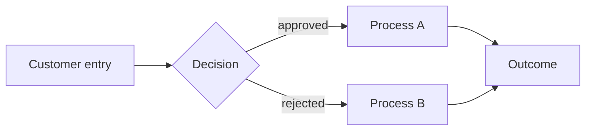

<!-- _header.md at the top -->

# Process map

High-level view of how capabilities connect in the business flow.

## Main diagram

## Processes by capability

### <Capability 1>
- Summary: ...
- Personas involved: ...
- Detail: [features/<slug>/flows.md](./features/<slug>/flows.md)

### <Capability 2>
...

## Approvals and exceptions
| Step | Who approves | Criterion | Exceptions |
|---|---|---|---|
| ... | ... | ... | ... |
